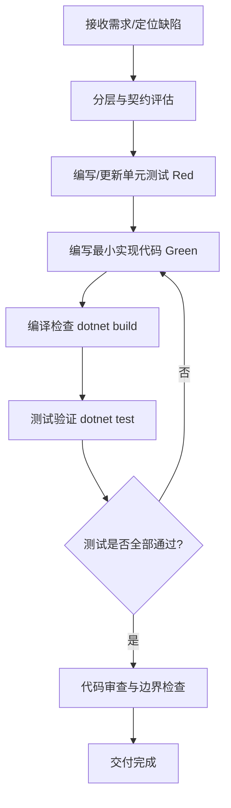

# 现代软件工程质量守卫工作流 (Software Engineering Guard)

本技能定义了从需求实现到完成验证的标准工程闭环流程，确保每一次变更均符合自动化测试、分层架构、空安全与零缺陷标准。

---

## 核心工作流流程



---

## 阶段执行指南

### 第一阶段：分层与契约评估

1. 确认本次变更涉及的代码层次：
   - 几何计算/算法/格式转换 -> 归属 `Core/`，纯类、无 WPF 依赖。
   - 状态/并发/命令 -> 归属 `ViewModels/`。
   - XAML/动画/交互行为 -> 归属 `Views/` (`MainWindow.xaml[.cs]`)。
2. 保持对外公开签名兼容，严禁无故修改未涉及模块。

### 第二阶段：测试先行（TDD 实践）

1. 定位或在 `AutoCutPic.Tests/` 相应测试类中添加测试用例：
   - 几何计算类：`CropGeometryCalculatorTests.cs`
   - 图像处理类：`ImageProcessorTests.cs`
   - 尺寸规则类：`PhotoSizeTests.cs`
2. 运行单元测试确认新用例失败或预期行为（Red）。

### 第三阶段：编写最小实现

1. 编写最简洁、最直接的代码通过测试。
2. 严格遵循 Nullable 与资源生命周期（`using var`）。
3. 偏移量与比例严格执行 `Math.Clamp` 范围防护。

### 第四阶段：自动化门禁验证

在根目录下执行自动化校验命令：

```powershell
# 1. 执行全量构建并检查警告
dotnet build -c Debug

# 2. 执行自动化测试套件
dotnet test AutoCutPic.Tests/AutoCutPic.Tests.csproj --nologo
```

必须满足以下条件才允许交付：
- 构建成功，无新引入编译警告。
- 测试套件全部通过，零失败。

### 第五阶段：检查清单（Checklist）

- [ ] 是否遵循了最小改动原则？
- [ ] 是否有非托管资源（如 `MagickImage`）未被释放？
- [ ] Core 层是否污染了 UI 依赖？
- [ ] 是否通过了自动化测试全量运行？
